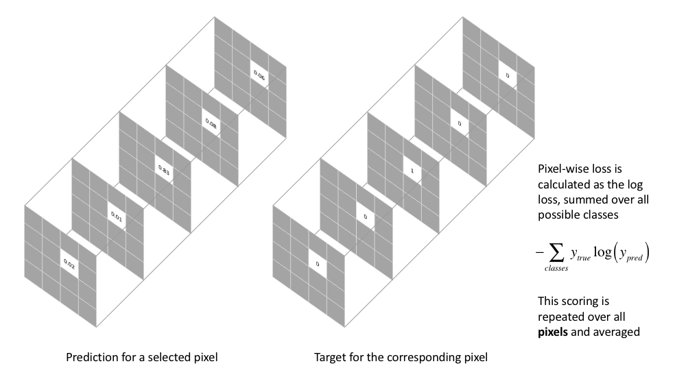

# Semantic Segmentation with Pretrainet ResNet18 model
- Semantic Segmentation Problem: MSRC-v2 Dataset
  - Utilized a Fully Convolutional Network (FCN) architecture for semantic segmentation.
  - Experimented with pre-trained models, including AlexNet, VGGNet, ResNet18.
  - Opted for ResNet18 in the final version which achieves **86% test accurac**y.
- Accuracy Enhancement Strategy
  - Implemented a pixel-wise cross-entropy loss function.
  - Precision in loss calculation allowed for the exclusion of unlabeled segments.
  - This approach, incorporating ResNet18 and a tailored loss function, contributed to the model's robust performance on the MSRC-v2 dataset in semantic segmentation tasks.

  

  <em>Pixel-wise loss function</em>

